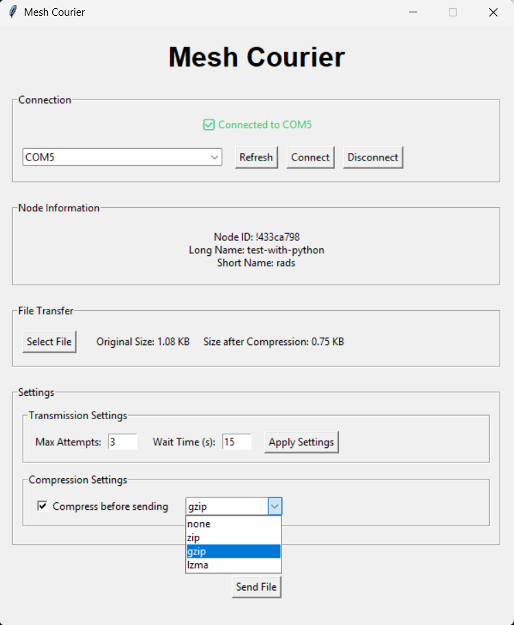
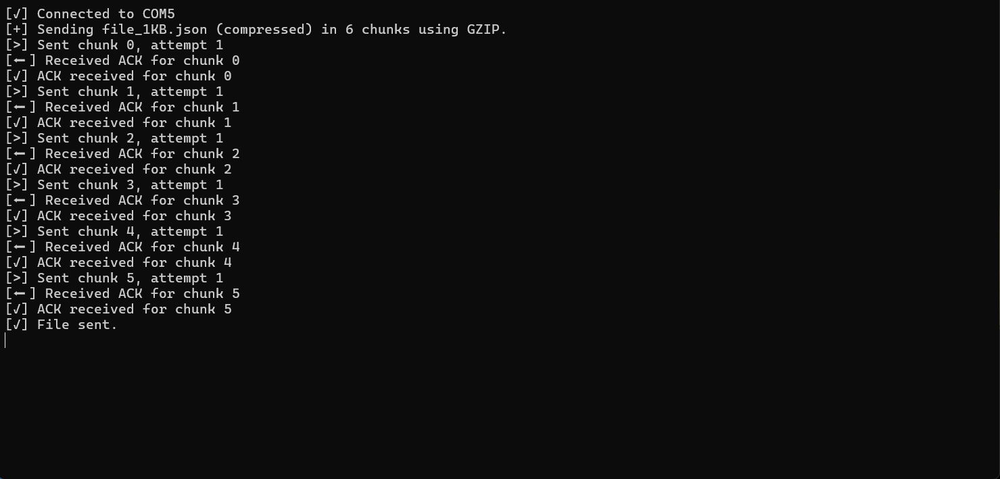
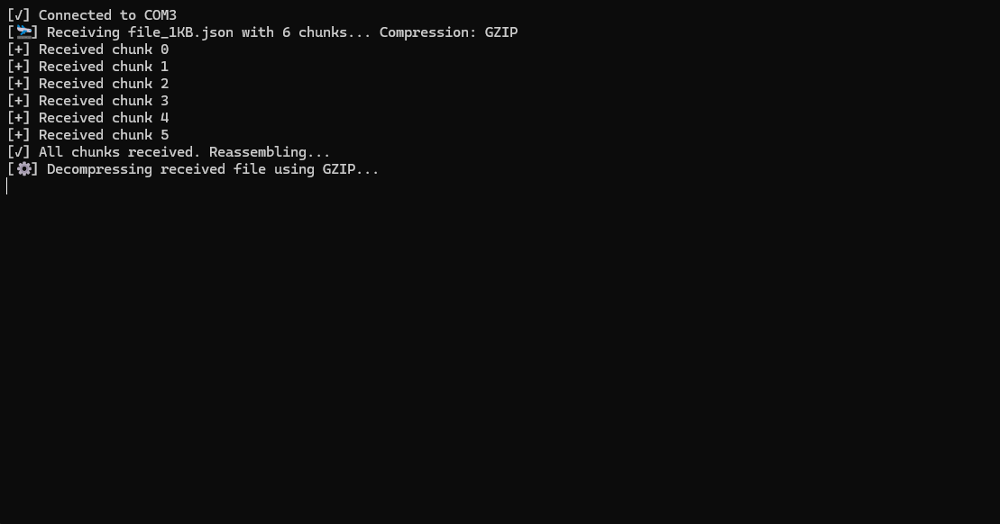

# Mesh Courier

A Python application for transferring files over Meshtastic radio networks. This application provides a user-friendly interface for sending and receiving files through Meshtastic devices, with support for compression.





---

## 🚧 Disclaimer

I am **not affiliated with the Meshtastic project or organization**. The name "Meshtastic" is only used to describe compatibility with the open-source device firmware and mesh communication protocol. All trademarks are the property of their respective owners.

---

## 🙋 About This Project

This project was created **just for fun and learning**. I'm not a professional Python developer — I’m building this with curiosity and the help of **LLMs** to better understand Python, file encoding, GUI design, and mesh networking. Feel free to suggest improvements or contribute!

---

## Features

- **File Transfer**: Send and receive files over Meshtastic radio networks
- **Compression Support**: Multiple compression options (ZIP, GZIP, LZMA)
- **Reliable Transfer**: Chunked file transfer with ACK-based reliability
- **User Interface**: Clean and intuitive GUI for easy operation
- **Connection Management**: Easy device connection and status monitoring
- **Node Information**: Display of connected node details
- **Transfer Settings**: Configurable retry attempts and wait times

---

## Supported File Types

- Text files (*.txt)
- CSV files (*.csv)
- JSON files (*.json)
- Archive files (*.zip, *.7z, *.gz, *.lzma, *.xz)

---

## Requirements

- Python 3.6 or higher
- Meshtastic device
- Required Python packages (see `requirements.txt`)

---

## Installation

1. Clone this repository or download the source code
2. Install the required dependencies:
   ```bash
   pip install -r requirements.txt
   ```

---

## Usage

1. Connect your Meshtastic device to your computer
2. Run the application:
   ```bash
   python main.py
   ```
3. Select your device from the dropdown menu
4. Click "Connect" to establish connection
5. Click "Select File" to choose a file to send
6. Configure compression settings if desired
7. Click "Send File" to start the transfer

---

## Transfer Settings

- **Max Attempts**: Number of retry attempts for failed chunks
- **Wait Time**: Time to wait for ACK before retrying (in seconds)
- **Compression**: Choose between different compression methods or none

---

## 📦 How It Works

When you send a file with **Mesh Courier**, the application performs the following steps:

### 🔧 1. Compression (Optional)

The selected file can be compressed using:

- ZIP
- GZIP
- LZMA
- None (raw)

This helps reduce file size for faster transmission over the mesh.

---

### 🔤 2. Base64 Encoding

Since Meshtastic transmits text-based JSON messages:

- The binary data is encoded in **Base64** (ASCII-safe)
- Ensures no data corruption over the network

---

### 📦 3. Chunking

The Base64-encoded file is split into **~220-character chunks**:

- Each chunk has a **chunk index**, **file ID**, and **metadata**
- Chunks are small enough to fit into a standard LoRa packet

---

### 📡 4. Transmission and ACKs

Each chunk is sent individually:

- Waits for an **ACK** from the receiver before sending the next
- Retries if no ACK received, up to the configured number of attempts
- This improves reliability over unstable or long-range connections

---

### 🧩 5. Reception and Reassembly

The receiving node:

- Collects all chunks
- Reassembles the full Base64 string
- Decodes it back to binary
- **Decompresses** it (if compression was used)
- Saves it to disk

---

### 📏 Recommended File Sizes

Because of LoRa’s bandwidth limitations:

- ✅ Best performance: **< 30 KB**
- 🔁 Possible: up to **~100 KB+** with retries and good signal
- 📉 Larger files may result in slow transmission or loss of chunks
- 💡 Compression helps minimize chunk count and transmission time

---

## Error Handling

Mesh Courier includes robust error handling for:

- Device connection issues
- File access or format problems
- Transfer timeouts or failures
- Compression and decompression errors

---

## Troubleshooting

**1. Connection Issues**
- Verify your device is connected and selected correctly
- Confirm the correct port is used
- Ensure the Meshtastic firmware is compatible

**2. Transfer Failures**
- Try smaller files
- Increase max retry attempts or wait time
- Use compression to reduce size

**3. Compression Errors**
- Try a different compression method
- Ensure enough RAM is available for compression

---

## Contributing

Contributions are welcome!  
If you spot bugs, have ideas for features, or want to improve the code, feel free to fork this repo and submit a pull request.

---

## License

This project is licensed under the **GPL-3.0 License**. See the `LICENSE` file for more details.

---

## Acknowledgments

- The [Meshtastic](https://meshtastic.org/) project for making mesh networking accessible
- The Python open-source community for making everything from GUIs to compression easy to implement
- ChatGPT and other LLMs for helping me learn as I go
